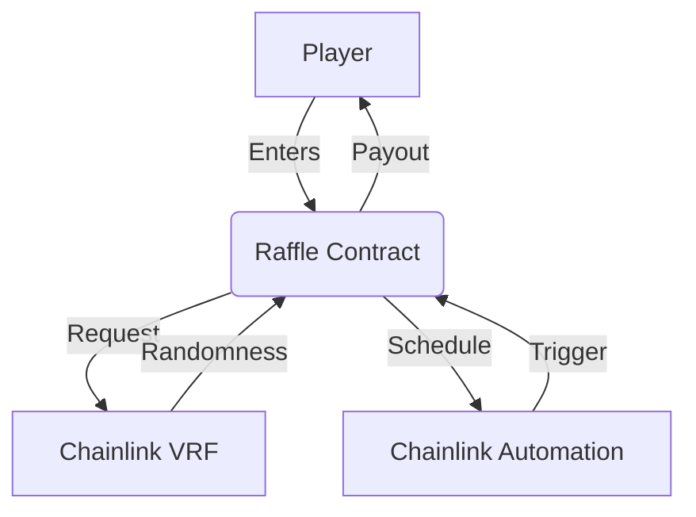

# 🎟️ Decentralized Raffle System


A fully decentralized raffle system powered by Chainlink VRF v2.5 for verifiable randomness and Chainlink Automation for periodic draws.

## 📌 Live Demo
- **Testnet Deployment**: [Sepolia Etherscan](https://sepolia.etherscan.io/address/0xA72A84fD5a7c14435E6bDfEBfA94089942253F0a)

## 🛠️ Tech Stack
- **Smart Contracts**: Solidity 0.8.19
- **Oracles**: 
  - Chainlink VRF v2.5 (Randomness)
  - Chainlink Automation (Custom logic)
- **Testing**: Foundry 

## 🚀 Quick Start

### Prerequisites
- [Foundry](https://book.getfoundry.sh/getting-started/installation)
- [MetaMask](https://metamask.io/) (For testnet interaction)

### Installation
```bash
git clone https://github.com/your-username/raffle-contract.git
cd raffle-contract
forge install
```

### Running Tests

```bash
# Unit tests (local)
forge test

# Integration tests (Sepolia fork)
forge test --fork-url $SEPOLIA_RPC_URL -vvv
```

### Deployment

#### 1. Configure Environment

Create `.env` file:

```ini
SEPOLIA_RPC_URL=https://sepolia.infura.io/v3/YOUR_KEY
PRIVATE_KEY=your_wallet_pk
ETHERSCAN_API_KEY=your_key
```

#### 2. Deploy to Sepolia

##### 2.1 **Chainlink Subscription Setup & Deployment Instructions**

###### **Step 1: Log in to Chainlink**

1. Access the [Chainlink VRF Dashboard](https://vrf.chain.link/)
2. Connect your wallet (ensure it matches the deployment account)

###### **Step 2: Create Subscription**

1. Navigate to "My Subscriptions" → "Create Subscription"
2. Select "Sepolia Testnet" (or your target network)
3. Copy the generated `subscriptionId`

###### **Step 3: Update HelperConfig**

Modify `HelperConfig.s.sol` as follows:

```solidity
function getSepoliaEthConfig() public pure returns (NetworkConfig memory) {
    return NetworkConfig({
        subscriptionId: 1234, // ← Replace with your new subscriptionId
        gasLane: 0x474e34a077df58807dbe9c96d3c009b23b3c6d0cce433e59bbf5b34f823bc56c,
        automationUpdateInterval: 30,
        raffleEntranceFee: 0.01 ether,
        callbackGasLimit: 500000,
        vrfCoordinatorV2_5: 0x8103B0A8A00be2DDC778e6e7eaa21791Cd364625,
        link: 0x779877A7B0D9E8603169DdbD7836e478b4624789,
        account: 0xYourDeploymentAddress // ← Fill with your deployer address
    });
}
```

###### **Step 4: Deploy Raffle Contract**

Run the deployment script:

```bash
forge script script/DeployRaffle.s.sol \
--rpc-url $SEPOLIA_RPC_URL \
--private-key $PRIVATE_KEY \
--broadcast \
--verify \
--etherscan-api-key $ETHERSCAN_API_KEY \
--slow
```

##### 2.2 Fund subscription Or  use UI (https://vrf.chain.link/)

```bash
forge script script/Interactions.s.sol:FundSubscription \
--rpc-url $SEPOLIA_RPC_URL \
--private-key $PRIVATE_KEY \
--broadcast
```

##### 2.3 **Chainlink Automation Setup Guide**

###### **Step 1: Access Chainlink Automation Console**

1. Go to the [Chainlink Automation Console](https://automation.chain.link/)
2. Connect your wallet (ensure it matches the address used to deploy the contract)

###### **Step 2: Register an Upkeep (Automation Job)**

1. Click **"Register New Upkeep"**
2. Select **"Custom Logic"**

###### **Step 3: Configure Upkeep**

1. **Contract Address**: Enter your deployed `Raffle` contract address
2. **Gas Limit**: Set sufficient gas (recommended ≥ 500,000)
3. **Trigger Conditions**:
   - **Check Data** (optional): Leave empty or enter `0x` (if the contract implements `checkUpkeep`)
   - **Trigger**: Choose **"Log Trigger"** (for event-based execution) or **"Time-based"** (for scheduled execution)

###### **Step 4: Activate Automation**

1. Confirm **Funding**: Ensure the Upkeep has enough LINK to cover gas costs
   - Get testnet LINK from the [Chainlink Faucet](https://faucets.chain.link/)
2. Click **"Register"** and sign the transaction

###### **Step 5: Verify Upkeep Status**

1. Check your Upkeep in the [Automation Console](https://automation.chain.link/)
2. Ensure the status is **"Active"**
3. Verify **"Last Run"** was successful

------

###### **Key Notes**

✅ **Your contract must implement `checkUpkeep` and `performUpkeep`** (refer to [Chainlink Docs](https://docs.chain.link/chainlink-automation))
✅ **Upkeep requires LINK balance** (testnet LINK is available for free)
✅ **Gas Limit must be sufficient** (recommended ≥ 500,000)

If issues occur, check:

- Whether the contract is deployed correctly
- If the connected wallet matches the deployer address
- If the subscription ID is correct

For a detailed tutorial, see: [Chainlink Automation Documentation](https://docs.chain.link/chainlink-automation)


## 📖 Contract Architecture



